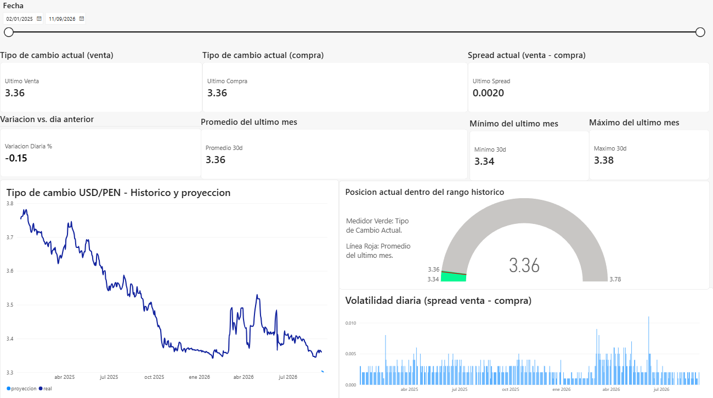
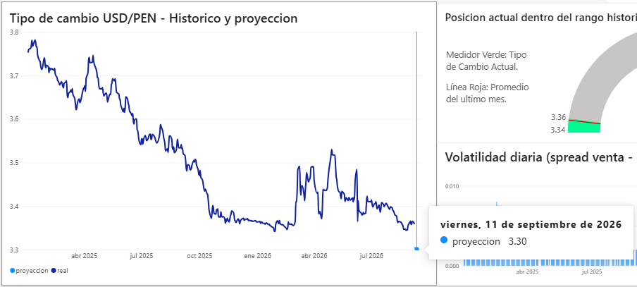
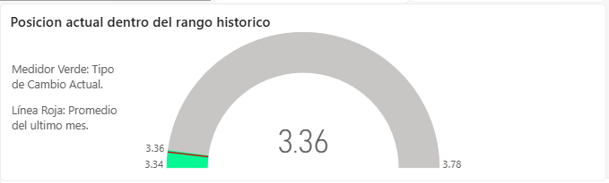

# Pipeline de Tipo de Cambio USD/PEN — BCRP

Pipeline de datos real, de punta a punta: extrae el tipo de cambio
oficial USD/PEN publicado a diario por el **Banco Central de Reserva
del Perú (BCRP)**, lo acumula en una base de datos histórica, genera
una proyección de tendencia y lo visualiza en un dashboard interactivo
de Power BI, actualizado automáticamente todos los días.

A diferencia de un proyecto con datos simulados, esta base **crece
cada vez que corre el pipeline**: cada ejecución trae datos reales
nuevos publicados por el BCRP.

## Dashboard



El dashboard incluye:
- Segmentador de fechas que controla todos los visuales
- KPIs principales (compra, venta, spread actual) y de contexto (variación diaria, promedio/mínimo/máximo del último mes)
- Gráfico de tendencia con histórico real + proyección a 7 días
- Medidor de posición actual dentro del rango histórico, con marca de referencia del promedio mensual
- Gráfico de volatilidad diaria (spread)
- Página de detalle con la tabla completa día por día





## Fuente de datos

[API pública de BCRPData](https://estadisticas.bcrp.gob.pe/estadisticas/series/ayuda/api) — gratuita, sin necesidad de API key ni registro.

- `PD04637PD` — Tipo de cambio interbancario, compra
- `PD04638PD` — Tipo de cambio interbancario, venta

## Arquitectura

API BCRP (JSON)
↓
extract_load.py → limpia y hace upsert en SQLite (sin duplicar fechas)
↓
tipo_cambio.db → histórico acumulado
↓
forecast.py → regresión lineal simple + exporta CSV
↓
Power BI Desktop → dashboard (histórico + tendencia + KPIs)

## Estructura del repositorio

├── python/
│ ├── extract_load.py # Extrae de la API BCRP y carga a SQLite (con reintentos)
│ └── forecast.py # Genera proyección de tendencia (CSV para Power BI)
├── sql/
│ └── schema.sql # Esquema de la tabla + vista de variación diaria
├── data/ # Se genera al correr el pipeline (no versionado)
├── docs/ # Capturas del dashboard
├── Tipo-cambio-dash.pbix # Dashboard de Power BI
├── requirements.txt
└── README.md


## Cómo ejecutar

```bash
pip install -r requirements.txt

# 1. Traer historial inicial (ej. último año y medio)
python python/extract_load.py --desde 2025-01-01 --hasta 2026-09-08

# 2. Generar proyección de tendencia (7 días hacia adelante)
python python/forecast.py --dias-adelante 7

# 3. Correr esto periódicamente para mantener la base actualizada
python python/extract_load.py --dias 10
```

### Automatizar la actualización diaria

El pipeline corre solo, todos los días, encadenando extracción y
proyección en un solo paso.

**Windows (Programador de tareas)** — crear una tarea que ejecute:
- Programa: `cmd.exe`
- Argumentos: `/c python python/extract_load.py --dias 10 && python python/forecast.py --dias-adelante 7 >> log.txt 2>&1`
- Iniciar en: la carpeta raíz de este proyecto

El `&&` asegura que la proyección solo se regenere si la extracción
funcionó correctamente, y el log queda registrado en `log.txt` para
depurar si algo falla.

**Linux/Mac (cron)** — equivalente corriendo a las 9pm todos los días:

0 21 * * * cd /ruta/al/proyecto && /usr/bin/python3 python/extract_load.py --dias 10 && /usr/bin/python3 python/forecast.py --dias-adelante 7 >> log.txt 2>&1


## Conectar Power BI

El archivo `Tipo-cambio-dash.pbix` ya viene armado, pero si quieres
reconstruirlo desde cero:

1. Obtener datos → Script de Python → cargar `tipo_cambio.db` con `sqlite3` + `pandas`
2. Obtener datos → Texto/CSV → `data/proyeccion.csv`
3. Relacionar ambas tablas por `fecha` (cardinalidad 1:1, dirección única desde `proyeccion` hacia `tipo_cambio`, para que la proyección no se vea recortada por la ausencia de datos futuros en `tipo_cambio`)

## Resultados

Con datos reales de enero 2025 a septiembre 2026:

- El tipo de cambio USD/PEN mostró una **tendencia bajista sostenida**, cayendo de S/3.80 a un mínimo cercano a S/3.34
- Se identificaron **dos períodos de mayor volatilidad** en el spread (compra-venta), particularmente entre abril y julio de 2026, coincidiendo con un repunte del tipo de cambio
- La proyección por regresión lineal, al comparase contra el valor real de mercado, mostró una diferencia de varios céntimos en el pronóstico a una semana — una limitación esperada del modelo (ver nota abajo), útil como punto de comparación para futuras versiones con modelos de series de tiempo

## Nota importante sobre la proyección

El modelo de `forecast.py` es una **regresión lineal simple**, elegida
a propósito por su transparencia y facilidad de explicar, no por su
poder predictivo. **No es un modelo financiero** ni debe usarse para
decisiones reales de cambio de moneda o inversión — el tipo de cambio
depende de muchísimas variables que un modelo lineal no captura. Su
valor en este proyecto es demostrar el flujo completo (extracción →
almacenamiento → modelo → visualización), que es exactamente lo que
se evalúa en una entrevista de Data Engineering.

## Posibles extensiones

- Agregar más series del BCRP (inflación, reservas internacionales, tasa de referencia)
- Reemplazar la regresión lineal por un modelo de series de tiempo (ARIMA, Prophet)
- Migrar de SQLite a SQL Server o PostgreSQL para un caso más "enterprise"
- Desplegar `extract_load.py` en un scheduler en la nube (GitHub Actions, Azure Functions)
- Publicar el dashboard en Power BI Service para verlo desde el navegador

## Fuente y licencia de los datos

Datos de acceso público bajo las
[condiciones de uso de BCRPData](https://estadisticas.bcrp.gob.pe/estadisticas/series/ayuda/condiciones-de-uso).


